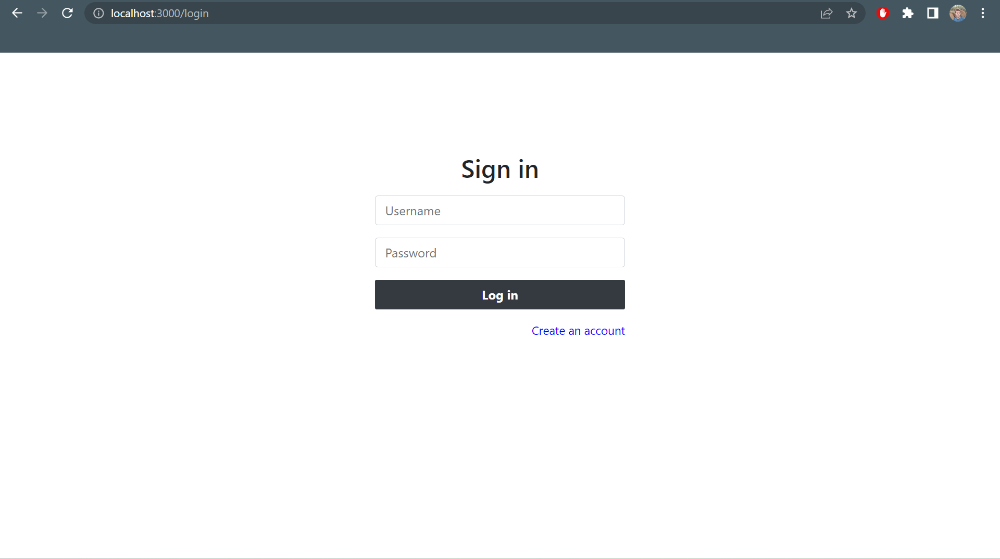
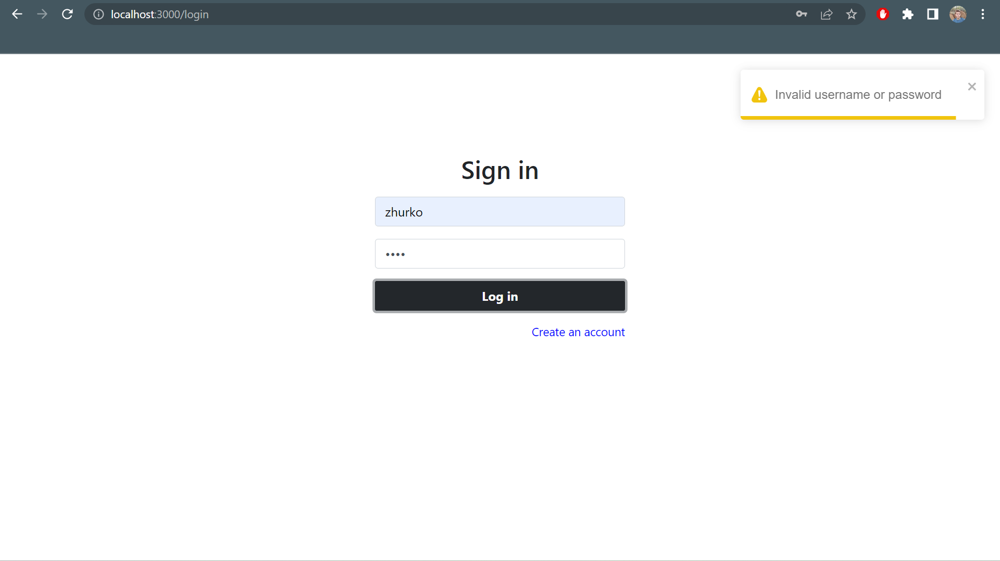
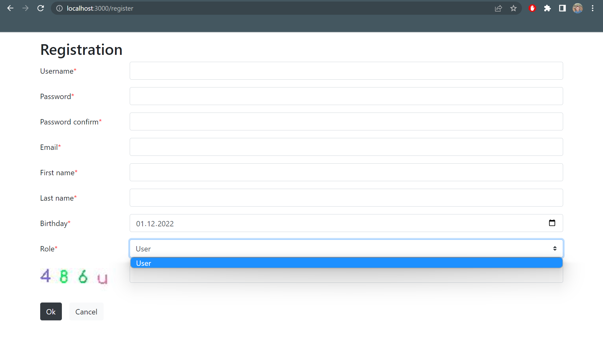
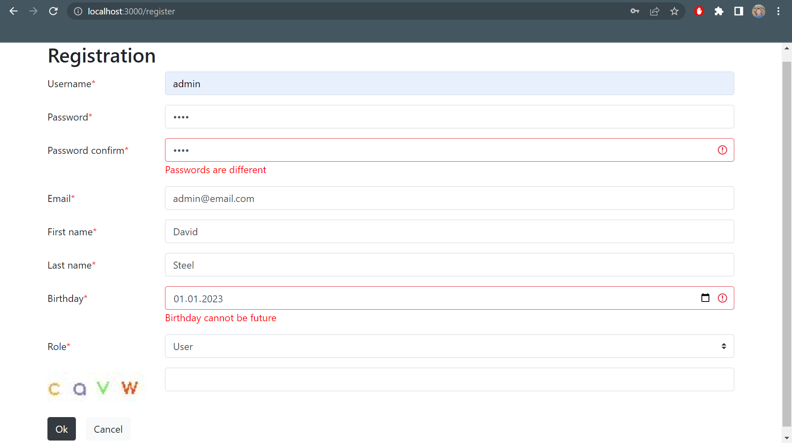
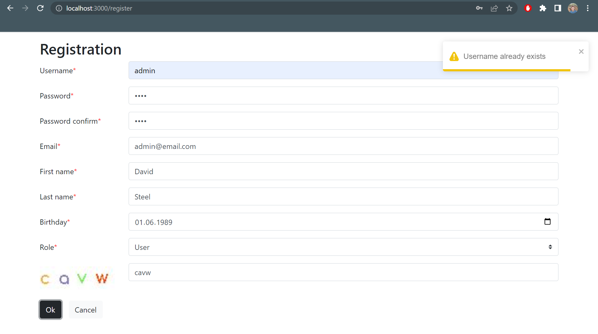
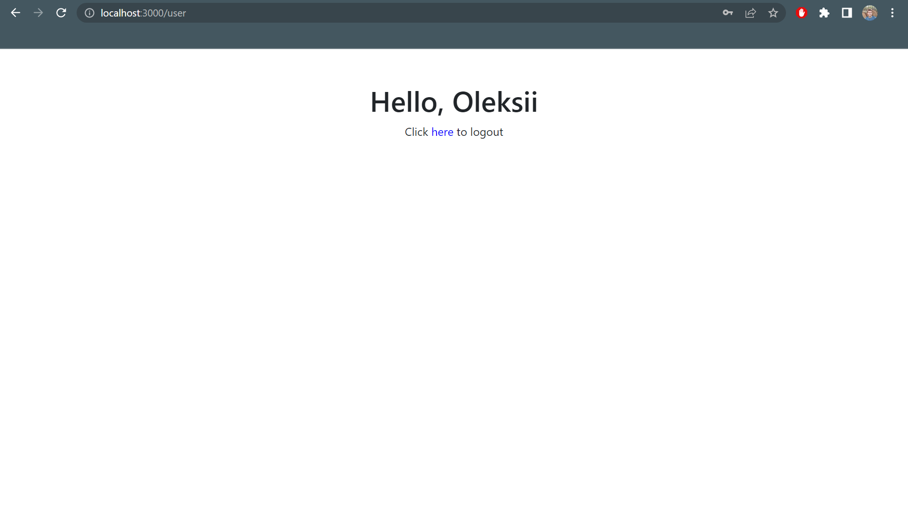
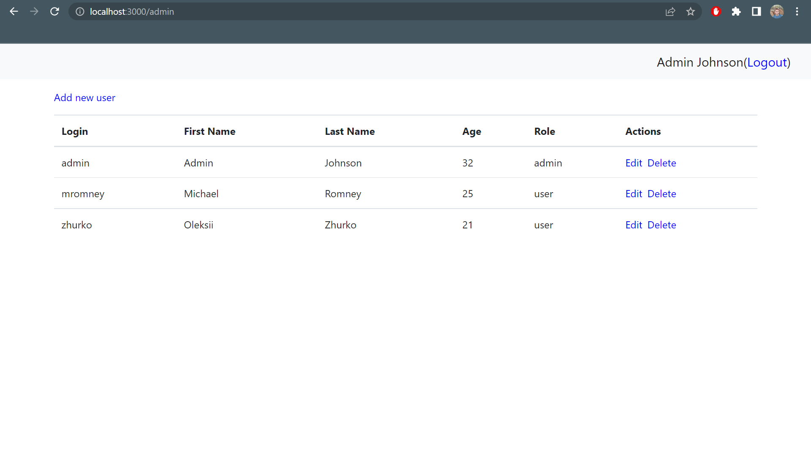
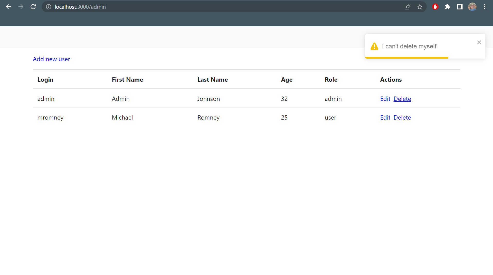
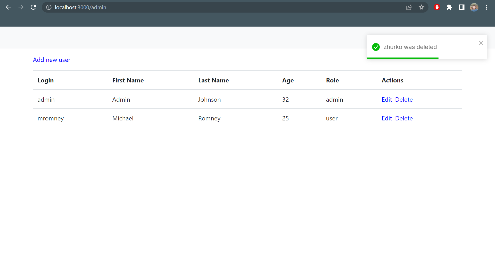
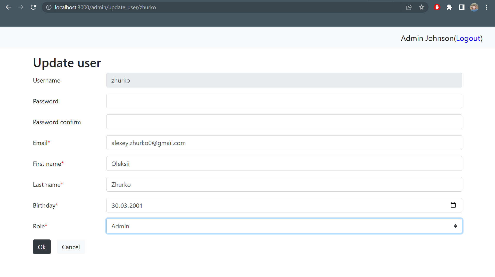

# RiVIM project

## Description

The project consists of lab parts.<br>
Contains 2 user roles and about CRUD operations on system users (admin role).<br>
Can be deployed and started locally.<br>












### Database
There is also a list of users to login:

| N   |  username | password |  role |
|:----|----------:|---------:|------:|
| 1   |    admin	 |     8888 | admin |
| 2   |   mromney |     1111 |  user |

### Backend endpoints
**Rotes:**

| Route                  |   Method |    Access |
|:-----------------------|---------:|----------:|
| `/generateCaptcha`	    |    `GET` | anonymous |
| `/login`	              |   `POST` | anonymous |
| `/register`            |   `POST` | anonymous |
| `/admin/get_all_users` |    `GET` |     admin |
| `/admin/get_user`      |    `GET` |     admin |
| `/admin/add_user`      |   `POST` |     admin |
| `/admin/update_user`   |    `PUT` |     admin |
| `/admin/delete_user`   | `DELETE` |     admin |

http://localhost:8080

### Frontend endpoints

| Route                |    Access |
|:---------------------|----------:|
| `/login`	            | anonymous |
| `/register`	         | anonymous |
| `/user`              |      user |
| `/admin`             |     admin |
| `/admin/create_user` |     admin |
| `/admin/update_user` |     admin |

http://localhost:3000

### Lab 1

Lab task involved the creation of backend part (java-backend).<br>
The backend includes following functionality and features:<br>
- CRUD operations
- PostgreSQL db interaction
- Security (CORS (only for localhost:3000), BCrypt, JWT)
- 2 user roles: user and admin
- Private REST API endpoints
- Captcha generator
- Exception handling
- Field validator

### Lab 2

Lab task involved the creation of frontend part (react-frontend).<br>
The frontend includes following functionality and features:<br>
- CRUD operations with backend
- Security (protected rotes for 2 roles)
- Field validator

### Lab 4

Security scans.<br>
GitHub build-in code scan is mostly enough for the project.<br>
But there should be at least 1 warning:
- Links integrity is not present for react-frontend in index.html

### Lab 5

Deploying.<br>
The project was deployed locally using docker-compose.<br>
Connection to db from backend occurs through the internal port.<br>
db init with data happens before running backend and frontend with the help of healthcheck.

## Starting app

Make sure you have installed Docker and Docker-compose.<br>
From root path of the project execute command to start the app:
```bash
docker-compose up --build
```

To close use:
```bash
docker-compose down
```